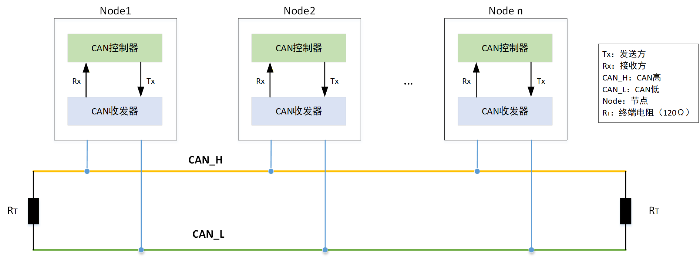
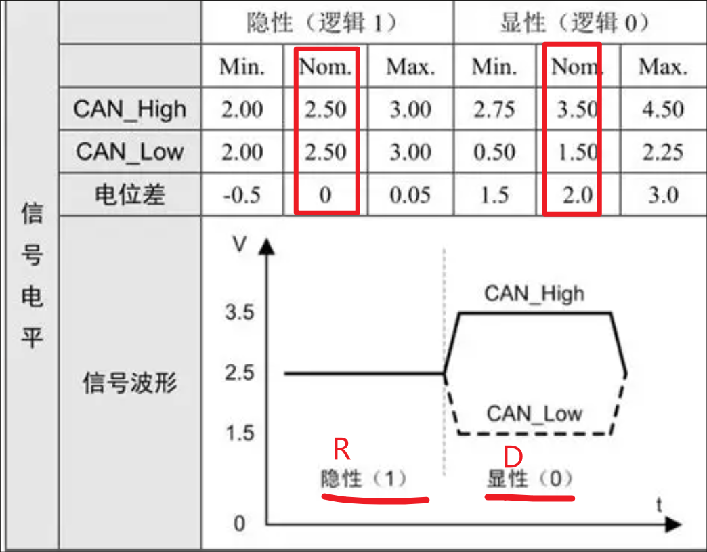
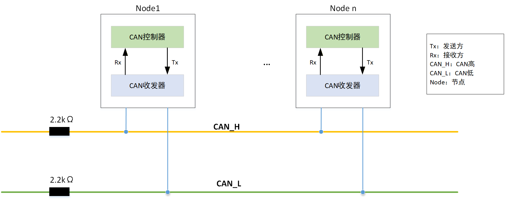
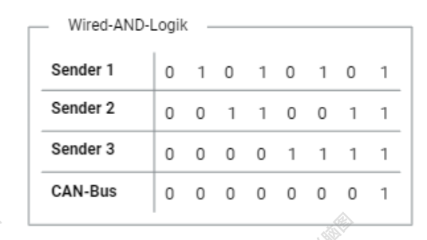
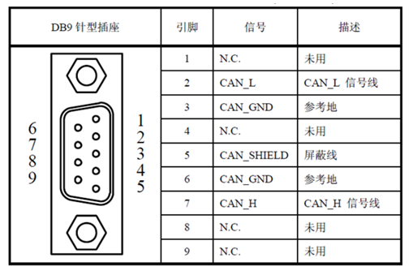
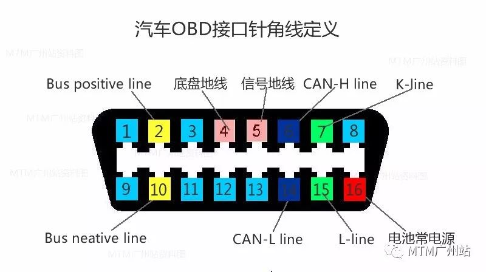

# 一文搞懂 ⌊CAN 总线 ⌉ ：从物理结构到实际接线

> 控制器局域网络（CAN）是汽车电子和工业控制领域最核心的通信协议之一。本文从物理层出发，自学理解 CAN 总线的闭环/开环结构、差分信号原理、终端电阻作用以及实际接线方式。

## CAN 总线概述

**控制器局域网络**（Controller Area Network，简称 CAN）是一种专为实时应用设计的**串行通信协议**，也是全球应用最广泛的现场总线之一。它最早由德国博世（Bosch）公司于 1980 年代开发，核心目标是解决现代汽车中日益庞大的电子控制单元（ECU）之间的通信问题——减少线束、提高可靠性、支持多主通信。

CAN 总线的物理传输介质本质上是**双绞线**，包含两根信号线：

- **CAN_H**（CAN High）
- **CAN_L**（CAN Low）

这两根线按照固定**绞距**（通常 20–50 mm）绞合在一起。使得 CAN 总线在电磁环境恶劣的汽车和工业现场中依然能稳定通信。

根据网络拓扑的不同，CAN 总线分为**闭环结构**和**开环结构**两种形式，下面逐一展开。

---

## 闭环结构（高速 CAN）

### 总线拓扑

闭环 CAN 是最常见的结构，两条总线（CAN_H 和 CAN_L）贯穿所有节点，并在物理线缆的**两个最远端**各跨接一个终端电阻。

每个 CAN 节点由三个核心组件构成：

| 组件 | 角色 | 职责 |
| :--- | :--- | :--- |
| **MCU**（微控制器） | 🧠 大脑 | 负责应用层逻辑，如车速计算、电机控制指令生成 |
| **CAN 控制器** | 📋 协议执行者 | 实现 CAN 通信协议（ISO 11898）的全部链路层功能 |
| **CAN 收发器** | 🔌 物理层接口 | 负责逻辑电平与差分信号之间的双向转换 |

**数据传输流程：**

1. MCU 将数据交给 **CAN 控制器**，由控制器按协议组帧；
2. 控制器通过 **TX 引脚**将二进制数据（0 和 1）发送给 **CAN 收发器**；
3. 收发器将逻辑电平转换为**差分信号**，通过 CAN_H 和 CAN_L 输出到双绞线总线上；
4. 接收端节点的收发器侦听差分信号，还原为逻辑电平，经 RX 引脚交给控制器，最终送达 MCU。

###  终端电阻：为什么是 120Ω？

这是面试和工程实践中的高频问题。

闭环 CAN 总线在物理线缆的两个最远端各并联一个 **120Ω** 的终端电阻，等效终端电阻为 **60Ω**。

**为什么必须加？**

核心原因是**阻抗匹配**——CAN 总线所用双绞线的特性阻抗约为 **120Ω**。当传输线末端接入一个与特性阻抗相等的负载时，信号到达终点后能量会被电阻**完全吸收**，从而：

- ✅ **消除信号反射**，保证波形干净；
- ✅ **提高抗干扰能力**；
- ✅ **确保总线快速进入隐性状态**（终端电阻为总线电容提供放电路径，显性→隐性时电压能迅速回落到隐性电平）。

> 一句话总结：不加终端电阻 → 信号在线缆末端反射回来 → 波形畸变 → 通信失败。

### 电气特性：显性与隐性

CAN 总线采用**差分信号**传输，逻辑 "0" 和 "1" 分别对应不同的电压状态。

先记住两个核心概念：

| 术语 | 英文 | 逻辑值 | 含义 |
| :--- | :--- | :--- | :--- |
| **显性** | Dominant | 0 | 主动驱动，信号强，具有总线仲裁优先级 |
| **隐性** | Recessive | 1 | 被动状态，可被显性覆盖 |

**信号电平定义（闭环 / 高速 CAN）：**

- **显性电平（逻辑 0）**
  - CAN_H ≈ **3.5V**
  - CAN_L ≈ **1.5V**
  - 压差 ΔV ≈ **2V**
  - 线路呈**闭合导通**状态，收发器主动推挽驱动

- **隐性电平（逻辑 1）**
  - CAN_H ≈ **2.5V**
  - CAN_L ≈ **2.5V**
  - 压差 ΔV ≈ **0V**
  - 线路呈**高阻态**，相当于回路断开，收发器不驱动

**理解要点：**

- 总线空闲时，两根线处于"浮空"的高阻态，表现为**隐性电平 1**，压差为 0；
- 当某个节点开始发送时，它通过**显性电平 0**强力拉开两根线的电压差（约 2V），争夺总线控制权；
- 显性可以"覆盖"隐性——这正是 CAN 总线**仲裁机制**的物理基础（详见下文"线与逻辑"）。

> **思考：为什么逻辑 0 是显性，逻辑 1 是隐性？**
>
> 这与底层的**"线与"逻辑**直接相关：在多节点并联的总线拓扑中，0 天然具有覆盖权和优先级。只要有一个节点输出 0（显性），总线就表现为 0。这一特性被巧妙地用于 CAN 的**非破坏性逐位仲裁**。详见第五节。

---

## 开环结构（低速容错 CAN）

### 总线拓扑

与闭环不同，开环结构中每个节点的 CAN_H 和 CAN_L 分别通过各自的上拉/下拉电阻连接到参考电平，不依赖彼此构成电流回路。

开环结构的关键特征在于**容错能力**——当 CAN_H 或 CAN_L 中任意一根线断裂时，节点仍可依靠另一根线继续通信（降速运行）。这在车门、座椅、空调等对实时性要求不那么苛刻的车身电子场景中非常实用。

---

## 闭环 vs 开环：一张表看懂核心差异

| 维度 | 闭环（高速 CAN） | 开环（低速容错 CAN） |
| :--- | :--- | :--- |
| **标准号** | ISO 11898-2 | ISO 11898-3 |
| **别名** | High-Speed CAN | Low-Speed / Fault-Tolerant CAN |
| **命名逻辑** | H/L 互为回流，**电流必须成环** | H/L 各自独立参考（GND / VBAT），**不依赖对方成环** |
| **最高波特率** | ≤ **1 Mbps**（≤ 40m 时） | ≤ **125 kbps** |
| **终端方式** | 两端各 **120Ω**（集中匹配，等效 60Ω） | 每节点 CAN_H→GND、CAN_L→VBAT，各 ~**2.2kΩ**（分布式） |
| **线缆阻抗** | 120Ω 特性阻抗双绞线 | 120Ω 也可，对阻抗不敏感 |
| **差分信号特征** | **对称镜像**：H/L 围绕 2.5V 反相摆动，显性 ΔV ≈ 2V | **VBAT 漂移**：H 靠 GND 拉、L 靠 VBAT 拉，显性 ΔV ≈ 3V |
| **显性电平** | CAN_H = 3.5V, CAN_L = 1.5V | CAN_H ≈ 4V, CAN_L ≈ 1V |
| **隐性电平** | CAN_H = CAN_L = 2.5V | H ≈ VBAT（约 5V），L ≈ GND（约 0V） |
| **容错能力** | ❌ 无，H 或 L 任意一根断裂 → 全线瘫痪 | ✅ 单线断裂仍可通信（自动降速续跑） |
| **理论节点数** | 112 | 112 |
| **实际节点数** | 1 Mbps 下 ≤ 32–64，降速可达百级 | ≤ 32（kΩ 级电阻拖累隐性电平，实际比闭环还少） |
| **最远距离** | 1 km（降至约 50 kbps 时） | 数百米（125 kbps 封顶） |
| **收发器类型** | 推挽输出（显性主动驱动，隐性高阻） | 推挽 + 每节点自带 VBAT 上拉 / GND 下拉 |
| **功耗** | 低（隐性时基本不耗电） | 略高（隐性时 kΩ 电阻持续存在漏电流） |
| **典型应用** | 发动机、ABS、变速箱、安全气囊、OBD（针脚 6/14） | 门窗、座椅、空调、中控锁、雨刮 |

> **选型口诀：** 实时性要求高、速率快 → **闭环**；容错要求高、速率低 → **开环**。

---

## 线与逻辑：CAN 仲裁的物理基石

CAN 总线的仲裁机制不依赖任何中心调度器，完全由物理层的**"线与"（Wired-AND）**逻辑实现。

**规则：**

- 显性电平 = 逻辑 **0**
- 隐性电平 = 逻辑 **1**
- 多节点同时发送时，遵循**线与逻辑**：**只有当所有节点都输出隐性（1）时，总线上才表现为隐性（1）；只要有一个节点输出显性（0），总线就表现为显性（0）。**

**仲裁过程简述：**

每个 CAN 节点在发送数据的同时会**回读总线电平**。当节点发送隐性位（1）却读到显性位（0）时，就知道有更高优先级的节点在竞争总线，此时该节点**自动退出仲裁**，转为监听模式。整个过程**不破坏正在传输的数据帧**，实现了高效、确定性的非破坏性仲裁。

这也正是 CAN 总线的核心魅力之一——用最简单的物理特性，解决了复杂分布式系统中的总线竞争问题。

---

## 实际接线：DB9 与 OBD-II

在实际工程中，CAN 总线通常通过标准化接插件引出。

### DB9 接口

DB9 插头内含 9 个插针，CAN 总线常用定义：

- **Pin 7** → CAN_H
- **Pin 2** → CAN_L

### OBD-II 接口

**OBD**（On-Board Diagnostics）是车辆诊断的标准接口，OBD-II 插头包含 16 个针脚。

常用 CAN 相关针脚（具体定义因 OEM 而异）：

- **Pin 6** → CAN_H（ISO 15765-4 定义）
- **Pin 14** → CAN_L（ISO 15765-4 定义）

> ⚠️ 不同车企（OEM）的针脚定义可能存在差异，实际接线请以对应车型的技术手册为准。

---

## 总结

本文从物理层角度梳理了 CAN 总线的核心知识体系：

1. **CAN 的本质**是差分信号 + 双绞线，天生抗干扰；
2. **闭环（高速 CAN）**依赖终端电阻消除反射，速率高达 1 Mbps，用于动力总成等实时场景；
3. **开环（低速容错 CAN）**牺牲速率换取容错，单线断裂仍可降速通信，用于车身电子；
4. **显性覆盖隐性**的物理特性，构成了 CAN 总线无中心仲裁机制的基础（线与逻辑）；
5. 实际工程中通过 **DB9** 或 **OBD-II** 接口与总线交互。

理解了这些物理层基础，再去看 CAN 的协议层（帧格式、滤波、错误处理）就会事半功倍。后续文章将继续深入 CAN协议。

---

## 参考

- [储能系统-CAN 通信的 120 欧姆电阻到底有啥作用？](https://blog.csdn.net/qingchunwang/article/details/155539508)
- [CAN 总线通信详解（超详细配 34 张高清图）](https://zhuanlan.zhihu.com/p/677658199)
- [CAN 为什么要用双绞线及 CAN 和 LIN 的 DB9 接口定义](https://blog.csdn.net/qq_41908302/article/details/137569927)
