# ISO 15765-2 网络层详解：单帧、多帧、流控与超时机制

> ISO 15765-2（又称 ISO-TP、DoCAN）是汽车诊断领域定义在 CAN 总线上做长数据包传输的**网络层 + 传输层**协议，对应 OSI 模型的第 3、4 层。本文梳理 N_PDU 的结构、四种 N_PCI 帧类型、多帧传输流程以及网络层超时参数。

---

## 协议定位

在 [CAN 协议全解](CAN%20协议全解：分层模型、四大帧、错误与过载机制梳理.md) 中我们提到，CAN 数据链路层一帧最多只能承载 **8 字节**（CAN FD 为 64 字节）。但 UDS 诊断服务（ISO 14229）的应用层数据最长可达 **4095 字节**——这就需要一个中间层来拆包和重组。

ISO 15765-2 就是干这件"打包拆包"活儿的协议。


### CAN CC vs CAN FD

2024 版 ISO 15765-2 已同时涵盖经典 CAN 和 CAN FD：

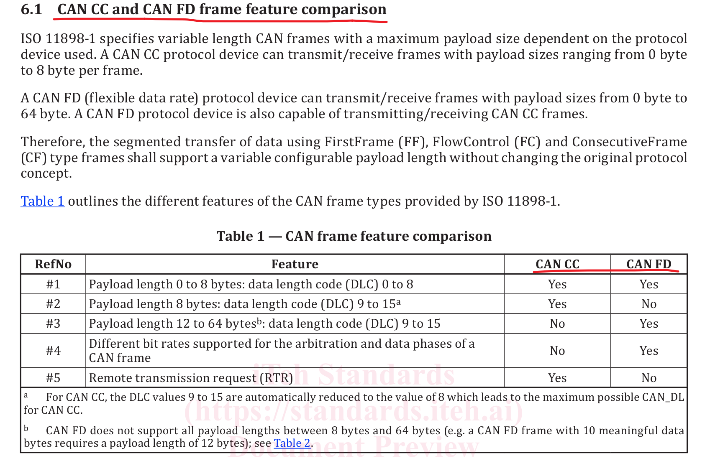

| 协议类型 | 每帧最大有效载荷 | 兼容性 |
|---------|:--------------:|-------|
| CAN CC   | 0–8 字节      | —     |
| CAN FD   | 0–64 字节     | 向下兼容 CAN CC |

> 一句话：CAN FD 单帧能装 64 字节，且能收发经典 CAN 帧；经典 CAN 单帧只能装 8 字节。

---

## N_PDU：网络层协议数据单元

网络层的核心任务就一件事：**将应用层数据转换为适应 CAN 总线的单帧或多帧格式。**

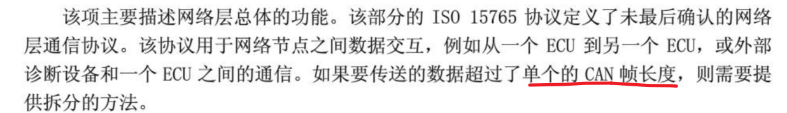

N_PDU（**N**etwork layer **P**rotocol **D**ata **U**nit，网络层协议数据单元）是实现这一任务的数据载体，由三部分组成：

| 组成部分 | 缩写 | 含义 |
|---------|------|------|
| **网络层地址信息** | N_AI | 源地址、目标地址等寻址信息 |
| **网络层协议控制信息** | N_PCI | 标识帧类型（单帧/首帧/连续帧/流控帧）及长度 |
| **网络层数据** | N_Data | 实际承载的应用层数据 |

三者关系：`N_PDU = N_AI + N_PCI + N_Data`。日常分析中最关键的是 N_PCI——它决定了数据怎么拆、怎么发。

---

## N_PCI：四种帧类型

N_PCI 定义了四种帧类型，用字节 0 的高 4 位来区分：

| 缩写 | 全称 | 含义 | 标识值 |
|:---:|------|------|:-----:|
| **SF** | Single Frame | 单帧，一帧搞定 | `0` |
| **FF** | First Frame  | 首帧，多帧传输的第一帧 | `1` |
| **CF** | Consecutive Frame | 连续帧，后续数据帧 | `2` |
| **FC** | Flow Control | 流控帧，接收方握手 | `3` |

下面逐一拆解每种帧的结构。

---

### SF — 单帧

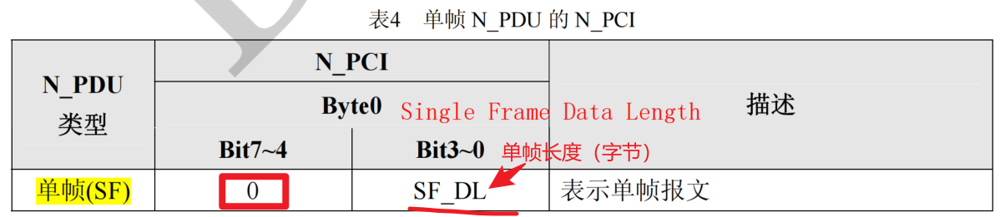

- 字节 0 高 4 位 = `0` → 单帧
- 字节 0 低 4 位 = 数据长度（最大 7 字节）

**举例：**

发送 `10 01` 进入默认会话——这一帧包含 2 字节数据，完整报文为：

```
02 10 01 00 00 00 00 00
```

发送 `28 00 01` 打开所有报文发送和接收——包含 3 字节数据：

```
03 28 00 01 00 00 00 00
```

> 单帧的逻辑很简单：数据 ≤ 7 字节，一个 CAN 帧直接发完，后面填 `00` 补齐 8 字节。

---

### FF — 首帧

当数据超过 7 字节，一帧装不下，就需要拆成多帧。第一帧就是**首帧**。

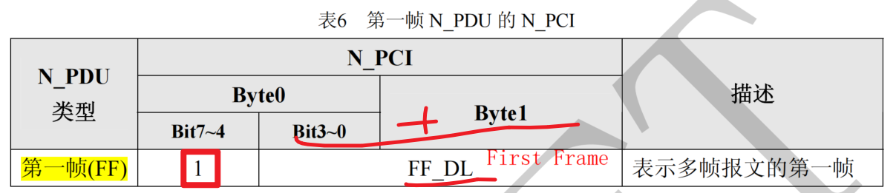

- 字节 0 高 4 位 = `1` → 首帧
- 字节 0 低 4 位 + 字节 1 = 12 位数据长度，最大 `0xFFF` = **4095 字节**

也就是说，ISO 15765-2 最多支持传输 4095 字节的应用层数据。


---

### CF — 连续帧

首帧发完后，剩余数据用连续帧依次发送。

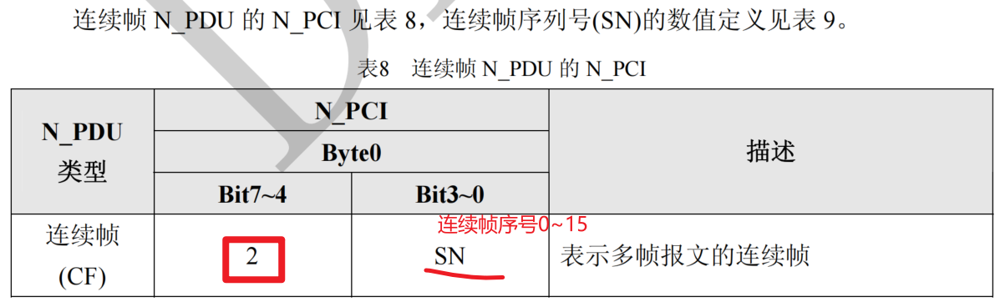

- 字节 0 高 4 位 = `2` → 连续帧
- 字节 0 低 4 位 = 序列号（SN，Sequence Number）

序列号规则：

| 组别 | 序列号范围 |
|-----|:--------:|
| 第 1 组 | `1, 2, 3 ... F`（从 1 开始） |
| 第 2 组 | `0, 1, 2 ... F`（从 0 开始） |
| 第 N 组 | `0, 1, 2 ... F`（从 0 开始） |

> 注意：只有第一组序号从 `1` 起，后续每组从 `0` 起。这样做是为了让接收方能区分第一组和后续组。

---

### FC — 流控帧

FF 之后为什么必须先插一帧 FC，而不是发送方直接哗啦啦把 CF 全发完？

这相当于接收方的**握手信号** 🤝——告诉发送方："我能接、接多快、接多少"。

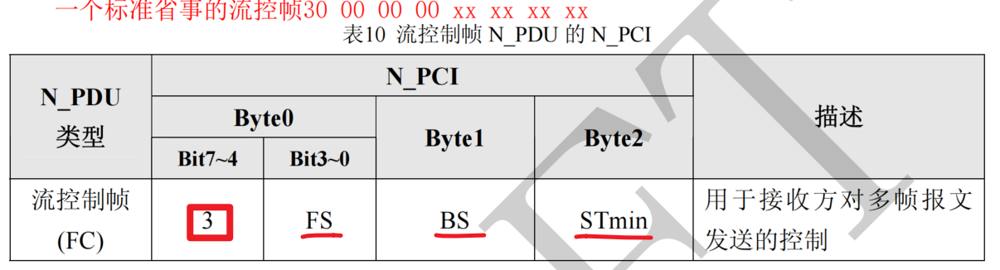

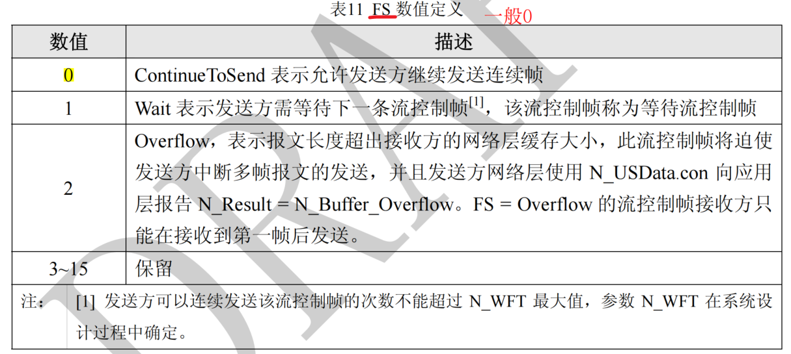

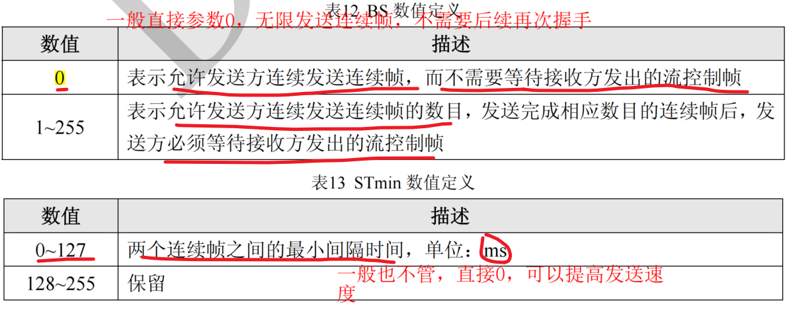

**流控帧字段解析**（以 `30 00 14` 为例）：

| 字段 | 值 | 含义 |
|------|:--:|------|
| 字节 0 高 4 位 | `3` | 流控帧标识 |
| 字节 0 低 4 位（FS） | `0` | Flow Status：`0`=允许发送，`1`=等待，`2`=溢出 |
| 字节 1（BS） | `00` | Block Size：连续帧持续发送次数。`00` 表示一直发，无需再发流控帧 |
| 字节 2（STmin） | `14` | 连续帧间最小间隔时间。`0x14` = 20ms |

---

#### BS 参数示例

BS = 3 时，每发完 3 个连续帧就必须再发一次流控帧：

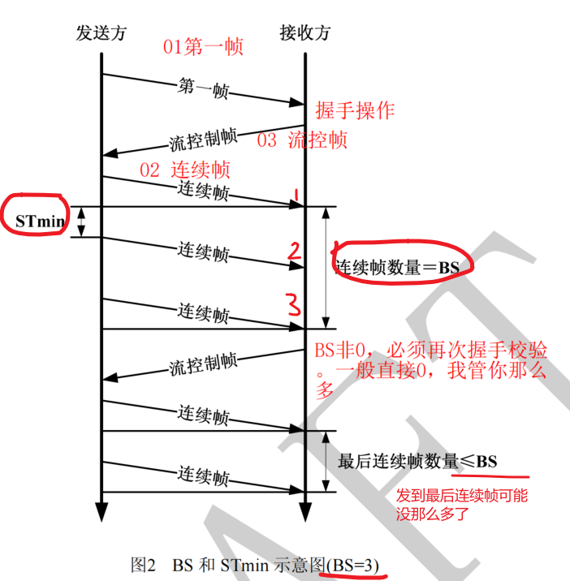

---

## 多帧传输示例

以下是一个完整的多帧传输过程：

```java
7XX Rx  10 26 36 01 71 18 E3 F1
// 1→首帧(FF)，0x026→共38字节数据，36 01 71 18 E3 F1→前6字节数据

7XY Rx  30 00 00 aa aa aa aa aa
// 3→流控帧(FC)，0→允许发送，BS=00→连续发送，STmin=00→无间隔，aa→填充

7XX Rx  21 50 08 80 00 65 F2 71
// 2→连续帧(CF)，1→第1个连续帧，后面7字节数据

7XX Rx  22 18 E5 F9 54 08 80 00
// 2→连续帧(CF)，2→第2个连续帧，后面7字节数据

7XX Rx  23 71 18 E3 F9 51 08 80
// 2→连续帧(CF)，3→第3个连续帧，后面7字节数据

7XX Rx  24 00 75 00 05 6B 2A 00
// 2→连续帧(CF)，4→第4个连续帧，后面7字节数据

7XX Rx  25 E6 F8 00 04 FF FF FF
// 2→连续帧(CF)，5→第5个连续帧，后面4字节数据+3字节FF填充
```

**38 字节怎么算的？**

- 首帧数据区：`36 01 71 18 E3 F1`（6 字节）
- 连续帧 21–25：5 帧 × 有效载荷（除 SN 外）= 4 × 7+4 = 32 字节
- 首帧 `10 26` 中的 `0x026` = 38，就是总数据长度，**首帧 6 字节 + 连续帧 32 字节 = 38 字节** ✓。其中 38-2=36 字节为有效数据。

---

## N_PDU 与 L_PDU 的映射关系

理解四种帧类型后，再看网络层（N_PDU）和数据链路层（L_PDU）的映射关系就一目了然：

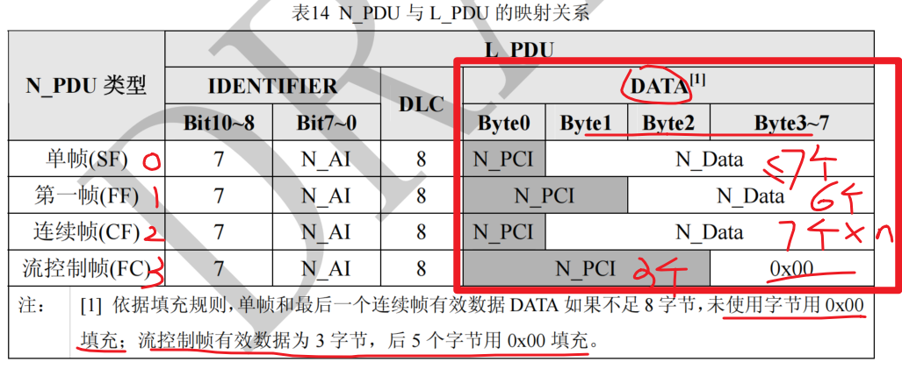

N_PCI 在单帧中占 1 字节，所以单帧最多传 **7 字节**数据。超出就要走多帧流程。

---

## 网络层超时参数

ISO 15765-2 定义了严格的超时机制，防止通信卡死：

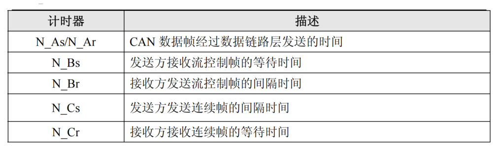

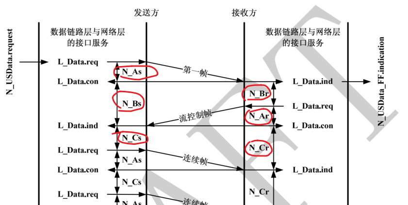

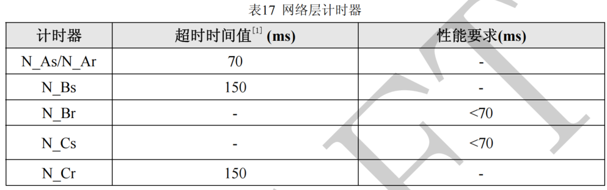

具体的参数值取决于 OEM 定义，不同车厂的超时设定可能不同，实际开发中以 OEM 需求规范为准。

---

# 总结

ISO 15765-2 网络层的核心逻辑用一张表就能说清楚：

| 场景 | 用哪种帧 | 流程 |
|-----|:------:|------|
| 数据 ≤ 7 字节 | **SF（单帧）** | 一帧发完，结束 |
| 数据 > 7 字节 | **FF → FC → CF…** | 首帧声明总长度 → 接收方流控握手 → 连续帧依次发送 |

**四个关键数字**记住就行：

- **7 字节**：单帧最大有效载荷
- **4095 字节**：多帧最大传输长度（`0xFFF`）
- **8 字节**：经典 CAN 一帧最大载荷（CAN FD 为 64 字节）
- **4 种帧**：SF(0)、FF(1)、CF(2)、FC(3) — 靠 N_PCI 字节 0 高 4 位区分

理解了这一层，再去看 UDS 诊断报文（`10 01`、`22 xx yy`、`2E xx yy` 等）就不会被单帧/多帧的拆包细节绊住了。

---

# 参考

- [UDS网络层/TP层（ISO 15765-2）的解读](https://blog.csdn.net/ChenGuiGan/article/details/105786406)
- [ISO15765-2 道路车辆——通过控制器局域网（CAN）进行诊断通信 (翻译版)(万字长文)](https://zhuanlan.zhihu.com/p/706200555)
- [UDS on CAN（DoCAN） - ISO 15765](https://blog.csdn.net/YaoXingzhiLeo/article/details/149335915)
