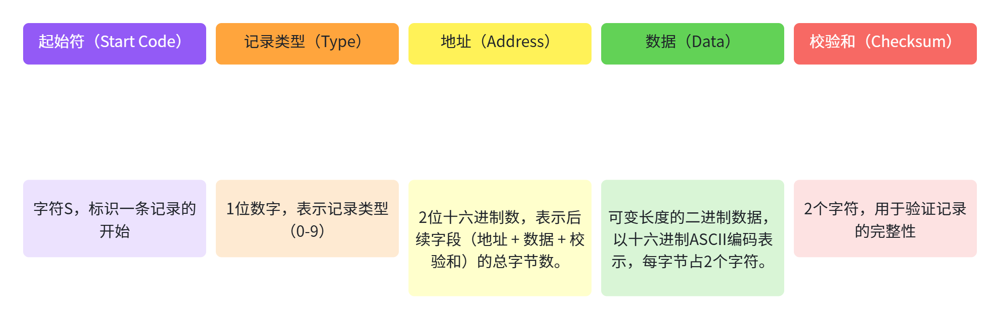
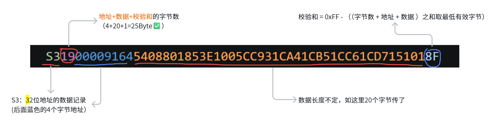
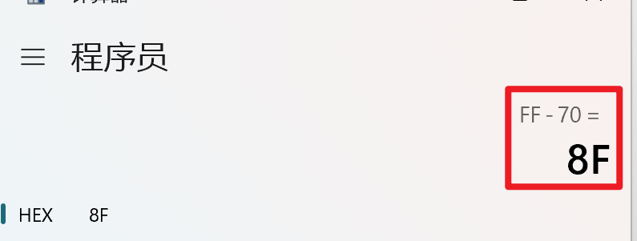
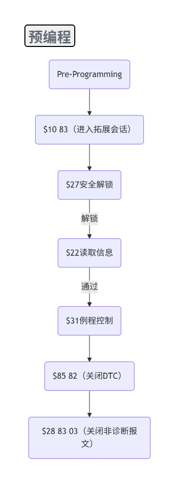
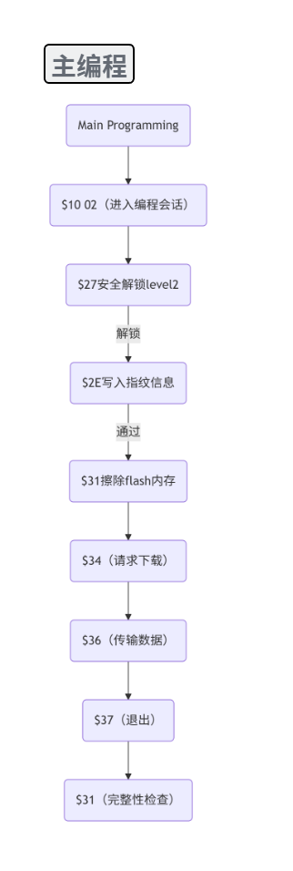
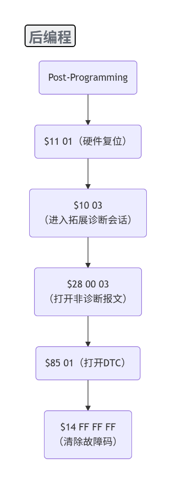

# 前言

在汽车电子领域，"刷写"是每个应用层工程师都绕不开的话题。但真正理解刷写，不能只停留在"拿诊断仪点一下升级"——你得知道数据写到了哪里（Flash）、代码在哪里跑（RAM）、谁来执行擦写（Flash Driver），以及整个流程是如何被标准化的（UDS Bootloader）。

这篇文章从 Flash 的物理特性讲起，逐层深入，帮你构建对 Bootloader 的系统性认知。

# Flash 是什么

## Flash 定义

闪速存储器（简称闪存），英文全称 Flash Memory（简称 Flash），是一种**非易失性**存储器。

- **非易失性**：掉电后数据不丢失（这一点和 RAM 相反）。
- **物理形态**：它是焊接在 PCB 板上的芯片（NOR Flash 为主），或者是 MCU 内部集成的存储阵列。
- **分类**：根据硬件上存储原理的不同，Flash 主要可以分为 NOR Flash 和 NAND Flash 两类。

| **维度**            | **NOR Flash**             | **NAND Flash**                   |
| :------------------ | :------------------------ | :------------------------------- |
| **单元结构**        | 并行，每位独立连位线/字线 | 串行，单元串联成串               |
| **接口**            | 类 SRAM，地址数据线分离   | I/O 复用（8/16 位），ONFI/Toggle |
| **最小访问**        | 字节级随机读              | 页（4 KB）读 / 块（128 KB+）擦   |
| **XIP（片上执行）** | ✅ 支持，代码可直接跑      | ❌ 不支持，必须先搬 RAM           |
| **读速度**          | 快，随机读 50–100 ns      | 慢，页读 25–50 μs                |
| **擦/写速度**       | 慢，擦除秒级              | 快，擦除 2–4 ms                  |
| **容量**            | 小，1 MB–1 GB             | 大，GB–TB，可 3D 堆叠            |
| **成本**            | 贵，约 NAND 的 10–20 倍   | 便宜，QLC 低至 $0.03/GB          |
| **坏块**            | 几乎无，ECC 可选          | 出厂 1–2% 坏块，必配 ECC + BBM   |
| **擦写寿命**        | SLC ~10 万次              | SLC ~10 万 / MLC ~3000 / TLC ~500  |
| **典型场景**        | BIOS、U-Boot、ECU 固件    | SSD、U 盘、eMMC、手机存储        |

**PC 类比**：虽然常被比作电脑的 SSD（固态硬盘），但在 MCU 架构中，Flash 更像是 **BIOS 芯片 + SSD 的混合体**——它不仅要存数据，还要存代码，甚至直接跑代码（XIP）。与传统的硬盘存储器相比，Flash 具有质量轻、能耗低、体积小、抗震能力强等优点。

## 核心物理特性

### 必须先擦除，后写入

出厂空片是全 1（0xFF），**只能从 1 写 0，不能从 0 写 1**——想把 0 改回 1，必须整块擦除。读操作速度快，但写入和擦除速度受 Flash 类型影响。

### 按块操作（Sector / Erase Block）

擦除不是以字节为单位，而是以**扇区（Sector）**或**块（Block）**为单位。写数据通常按页（Page）或字（Word）。

| 概念           | 物理/逻辑属性 | 核心作用                   | 操作限制                           | 大小范围（STM32 典型值）          |
| -------------- | ------------- | -------------------------- | ---------------------------------- | --------------------------------- |
| 页（Page）     | 逻辑/物理单元 | 最小**编程单元**（写操作） | 只能编程（1→0），不能单独擦除      | 128 B、256 B、512 B（如 STM32F1/F4） |
| 扇区（Sector） | 物理单元      | 最小**擦除单元**（基础级） | 必须整扇区擦除，擦除后可分页编程   | 4 KB、8 KB、16 KB、64 KB、128 KB    |
| 块（Block）    | 物理/逻辑单元 | 多个扇区的集合（高级擦除） | 整块擦除（效率高于单扇区多次擦除） | 64 KB、128 KB、256 KB（如 STM32H7） |

### 擦写寿命有限

每个扇区有擦写次数限制（通常 10 万次左右）。擦写超过一定次数后，该数据块将无法可靠存储数据，成为坏块。

### 忙时不可访问

当 Flash 控制器正在执行**擦除**或**写入**操作时，Flash 阵列会被锁定，此时 CPU **无法从 Flash 中取指令**（Busy 状态）。

### 读写干扰

这是 Flash 特有的物理副作用，RAM 没有。

- **读干扰（Read Disturb）**：反复读同一个 Wordline，高能电子可能漂进相邻 Cell 的浮栅，把 1 漂成 0。
- **写干扰（Program Disturb）**：写某页时，同 Block 内其他未写单元可能被轻微加压，导致 bit 漂移。

NAND 尤其严重（单元密度高），所以 NAND **必配 ECC**（BCH / LDPC，能纠几十 bit）。NOR 密度低、干扰小，小容量可以裸跑，大容量 NOR 也开始上 ECC 了。

### 电荷泄漏与数据保留（Data Retention）

浮栅里的电子并不是真的"出不来"——高温 + 时间会慢慢泄漏。不过时间比较长，一般十年左右。所以 Bootloader 刷写完成后做 **CRC / Checksum 校验**并不是多余动作：既验传输正确性，也验"刚写完读回来对不对"，防的是**写干扰 + 早期漏电**。

## 分区隔离

Flash 在逻辑上被强制分割成几个独立的区域，以满足应用程序、配置数据、用户数据及系统升级等需求。

- **Bootloader 区**：存放启动和刷写代码。通常受到**写保护（Write Protection）**，防止被意外擦除。ECU 上电后从这里启动。
- **APP 区**：存放应用逻辑，是我们日常迭代更新的地方。App 的二进制数据最终归宿是 Flash 的 App 区。
- **标定/配置区**：存放 VIN 码、标定参数等。
- **Flash Driver 暂存区**（部分方案）：用于存放待加载到 RAM 的驱动代码。当 Flash Driver 在擦写 Flash 时，CPU 必须回避——**只能在 RAM 中运行 Flash Driver 程序**，否则会死机。

## ROM 和 Flash 的关系

Flash 属于 ROM 的一种，是 ROM 家族里"**能电擦除、能反复写**"的后代。

| **世代** | **类型**       | **特点**                                          | **车上还能见到吗**                            |
| :------- | :------------- | :------------------------------------------------ | :-------------------------------------------- |
| 初代     | **Mask ROM**   | 掩模出厂固化，再也改不了，便宜但死板              | 基本绝迹，老一代简单 ECU 可能还有             |
| 二代     | **OTP / PROM** | 一次性可编程，熔丝位烧断就定死                    | 少数防盗、密钥存储                            |
| 三代     | **EPROM**      | 紫外线照着擦，陶瓷窗那种，拔下来晒半小时          | 博物馆级别了                                  |
| 四代     | **EEPROM**     | 电擦除，字节级改，贵、慢、容量小                  | **车上还在用**：存 VIN、DTC、少量标定         |
| 五代     | **Flash**      | EEPROM 的"块擦除改良版"，容量大、便宜、**能 XIP** | **ECU 主力**：代码 + 标定 + Bootloader 都在这 |

# RAM

## RAM 定义

**RAM（Random Access Memory，随机存取存储器）** 是 ECU 的**易失性存储介质**。

- **易失性**：掉电即丢数据，每次上电都是"空白状态"。
- **物理形态**：通常是 MCU 片内集成的 SRAM（Static RAM），容量远小于 Flash（几十 KB 到几 MB 不等）。
- **PC 类比**：👉 **内存条（DDR）**——速度快、可随时读写、掉电清零。

## 核心物理特性

RAM 和 Flash 的性格几乎是**互补的**：

| 特性           | Flash           | RAM               |
| -------------- | --------------- | ----------------- |
| 掉电           | 不丢            | **全丢**          |
| 读写方式       | 先擦后写        | **任意读写**      |
| 操作粒度       | 扇区/页         | **字节/字**       |
| 速度           | 慢（ms 级擦除） | **极快（ns 级）** |
| 寿命           | 有限            | **无限（理论）**  |
| 执行代码       | 可以（XIP）     | **可以（更快）**  |
| 写时是否锁总线 | ✅ 锁            | ❌ 不锁            |

# Flash Driver

## Flash Driver 定义

Flash Driver 是一段专门用于"擦除和写入 Flash"的底层代码（C 函数），底层通过操作 MCU 的 **Flash 控制寄存器**来实现。Flash Driver 必须被加载到 RAM 中运行，由 Bootloader 调用。

AUTOSAR 体系下，Flash Driver 对外暴露几个核心 API（简化版）：

```c
Flash_Init()        // 初始化 Flash 模块时钟、等待周期
Flash_Erase(addr)   // 发擦除命令，按 Sector 整块清 0xFF
Flash_Write(addr, buf, len)  // 按 Page 写入，NOR 一般 256B/512B 一页
Flash_Read()        // 顺手带一个，校验用
Flash_BlankCheck()  // 擦完查空
```

> ⚠️ 在进行软件升级时，按照逻辑块的起始地址和长度进行**整个逻辑块的擦除**。实际刷写 A 区还是 B 区由 ECU 自己确定。

## Flash Driver 的"生命周期"

Flash Driver 的生命周期很短，分为四个阶段：

**① 静态存在（上电前）**

这时候它不是程序，只是一堆二进制机器码，静静地躺在 Flash 的 `Drv_Reserve` 区里，和图片、字体文件没什么区别。

**② 加载阶段（Bootloader 负责）**

- **触发条件**：ECU 上电初始化（Bootloader 阶段）或收到诊断仪的刷写请求。
- **动作**：`memcpy()`。Bootloader 执行一段特殊的拷贝代码（这段代码本身在 Flash 里，但只读数据不擦 Flash），把 `Drv_Reserve` 里的二进制数据原封不动地拷贝到 RAM 的指定地址（如 `0x4000_xxxx`）。
- **状态**：**从数据变成代码**。此时它还在 RAM 里等待被调用。

**③ 运行阶段（RAM 中执行）**

- **触发条件**：收到刷写指令（UDS 0x34/0x36）或需要擦除/写入 Flash 时。
- **动作**：CPU 的 PC 指针跳转到 RAM 中的 Flash Driver 入口函数。
- **独占总线**：CPU 在 RAM 里跑，Flash 控制器在忙着擦写 Flash。两者井水不犯河水。

**④ 消亡阶段（刷写结束）**

- **触发条件**：刷写结束（无论成败）后的系统复位（Reset）。
- **动作**：MCU 复位，RAM 的内容（包括那个正在运行的 Flash Driver）瞬间清零。
- **状态**：回归虚无。下次上电如果需要刷写，它会再次从 `Drv_Reserve` 被唤醒；如果不刷写，它就永远不需要醒来。

## RAM 与 Flash Driver 的关系

**经典误区** ❌：Flash Driver 在 Flash 里面运行。

这叫**自举悖论（Self-Referential Paradox）**：

> 我想修改房子，但我站在房子里，一动房子我就没地方站了。

**正确的关系是**：Flash Driver 由 Bootloader 从 Flash 加载到 RAM，然后在 RAM 中执行。

比如升级 APP 时，如果 CPU 一边在 Flash 上执行代码，一边去擦除/修改 Flash，CPU 总线会繁忙，导致取指失败或擦写异常。所以会把一小段"Flash 擦写驱动程序"（Flash Driver）从 Flash 的只读区完整复制到 RAM 中。CPU 设置好中断向量表，然后**强制跳转到 RAM 中的这段驱动程序执行**。此时 CPU 的物理位置在 RAM，它就可以安全地指挥 Flash 控制器擦写 Flash 的物理地址了，互不干扰。

```
Flash Driver（在 Flash 中躺着）
   ↓
Bootloader memcpy()
   ↓
RAM（Flash Driver 在此运行）
   ↓
Flash Driver 操作 Flash
   ↓
CPU 从 RAM 取指 ✅
```

RAM 在这里扮演了三个角色：

- **载体**（Code resides here）
- **执行环境**（CPU fetches here）
- **隔离区**（避免 Flash 擦写冲突）

总结：把 Flash Driver 放进 RAM 执行，是为了：

1. **让 CPU 取指的源（RAM）和擦写的目标（Flash）分开**，避免总线冲突；
2. Flash 控制器专心处理擦写命令，不受 CPU 取指干扰；
3. 擦写期间 CPU 仍然能正常执行代码（虽然此时它执行的正是擦写逻辑本身）。

## Flash Driver 和 Bootloader 的职责边界

很多人容易把 Flash Driver 和 Bootloader 混为一谈，这里做一个清晰的对比：

| 职责                       | Bootloader         | Flash Driver     |
| -------------------------- | ------------------ | ---------------- |
| 通信（CAN / ETH）          | ✅                  | ❌                |
| UDS 服务（10/27/34/36/37） | ✅                  | ❌                |
| 安全校验 / 签名            | ✅                  | ❌                |
| 擦除 Flash                 | ❌                  | ✅                |
| 写入 Flash                 | ❌                  | ✅                |
| 运行位置                   | Flash              | RAM              |
| 是否可被擦写               | 受写保护（无法写入） | 每次刷写重新加载 |

# RAM 和 Flash 空间分配

一个常见的问题是：Flash 和 RAM 各分配多大？谁更大？答案取决于实际需求。

- **Flash**：存放 `.text`（代码段）和 `.rodata`（只读数据段），需要容纳整个固件镜像。
- **RAM**：存放 `.data`（已初始化全局变量）、`.bss`（未初始化全局变量）、栈（Stack）和堆（Heap），只需要够运行时用。

通常情况下，**Flash 比 RAM 大几倍到几十倍**——程序 + 常量全部塞 Flash，RAM 只需覆盖运行时状态即可。

# Boot 和 Bootloader 是一个意思吗？

**不完全一样**。Boot 的概念更大，涵盖整个启动过程；Bootloader 是其中专门负责刷写的核心软件组件。在汽车电子语境下，Bootloader 特指基于 UDS 协议的刷写引导程序。

## Boot（启动过程）

Boot 指的是系统从通电到操作系统完全就绪的**宏观启动过程**，包括硬件上电、初始化、加载操作系统内核及相关应用程序等所有步骤。它是一个整体概念，涵盖了从硬件复位到系统可用的完整流程。

## Bootloader（启动加载程序）

Bootloader 是 Boot 过程中的**核心软件组件**，位于系统最底层。其主要职责包括：

- **硬件初始化**：完成 CPU、内存控制器、时钟、串口等基础硬件的配置。
- **加载操作系统内核**：从存储设备（如 eMMC、SD 卡、SPI Flash）读取操作系统镜像到内存，并传递必要参数（如设备树地址、命令行参数）。
- **启动内核**：将控制权交给操作系统，使系统进入运行状态。

在嵌入式系统中，Bootloader 通常是**第一段执行的可编程代码**，独立于操作系统运行环境，并且高度依赖于 CPU 架构和板级硬件配置。

# Bin / Hex / S19 格式

刷写需要导入刷写文件。常用的刷写文件格式有三种：Bin、Hex 和 S19。它们装的都是**编译好的机器码（固件）**，但结构和用途有区别：

| **格式** | **本质**          | **是否有地址信息** | **是否有校验** | **文件大小** | **可读性** |
| :------- | :---------------- | :----------------- | :------------- | :----------- | :--------- |
| **Bin**  | 纯二进制镜像      | ❌ 无               | ❌ 无           | 最小         | 不可读     |
| **Hex**  | Intel Hex 文本    | ✅ 有               | ✅ 有           | 较大         | 可读       |
| **S19**  | Motorola S-Record | ✅ 有               | ✅ 有           | 较大         | 可读       |

S19 和 Hex 几乎是同类格式——同样是**文本行 + 地址 + 数据 + 校验**的结构，S19 支持更长的地址空间。

刷写时，有了地址信息，才知道要刷到哪里（起始地址、结束地址）；有了校验信息，才知道刷写是否正确完成。刷写前还需要确认：目标地址空间够不够大？

下图是 S19 文件格式的宏观结构：



`.s19` 文件中某一行数据的解析示例：





# 基于 UDS 的 Bootloader

## 原理

为了规范 Bootloader 的全过程，汽车行业采用基于 UDS（Unified Diagnostic Services）的 Bootloader。刷固件的过程不是一股脑把文件扔过去，而是**按 UDS 定义的标准服务一步一步来**。

UDS 刷写基于**客户端-服务器模型**：诊断仪（Tester）发请求，ECU（Server）回响应。

## 刷写流程

完整的刷写流程分为三个阶段：预编程、主编程和后编程。

> 下面涉及的服务、子功能等，均来自 ISO 14229 UDS 诊断协议。各家的刷写流程大同小异，实际工作中遇到问题，主要靠看报文和 NRC 码来定位——配合一个好用的上位机可以事半功倍，NRC 码含义能直接弹出来，省去一个一个翻 log 的麻烦。

## 预编程（Pre-Programming）

预编程阶段为刷写准备网络条件，下位机需支持流程中的所有服务，上位机按流程发送诊断报文。



## 主编程（Main Programming）

主编程阶段负责下载应用软件或应用数据。



## 后编程（Post-Programming）

后编程阶段用于重同步 CAN 网络——相当于手机刷完机需要重启一遍。



## 误区纠正

我一开始以为"从 App 刷 = 刷 App 区"，"从 Boot 刷 = 刷 Boot 区"。**这个理解是错的。**

正确的是：**"从 X 刷"指的是——刷写会话建立时，ECU 当前正在运行的是哪段代码**。刷的目标可以是 App 区，也可以是 Boot 区，但大多数时候我们说"刷写"默认指的是刷 **App**。

# 总结

回顾全文，理解 Bootloader 需要把握三条主线：

1. **理解硬件基础**：Flash 的非易失性与块操作特性、RAM 的易失性与任意读写能力，以及 Flash Driver 为什么必须在 RAM 中运行。
2. **理解刷写文件格式**：Bin、Hex、S19 三种格式的本质区别——有没有地址信息、有没有校验，直接决定了刷写流程中如何处理它们。
3. **理解刷写流程**：基于 UDS 的三阶段刷写（预编程 → 主编程 → 后编程），每一步都有明确的服务和目的。

从应用层的角度，无需关注太多底层硬件细节，但如果能理解底层原理，就能更容易地消化应用层的内容，排查问题时也会更有方向感。如果个人理解有偏差，欢迎参考下方的资料。

# 参考

- [存储数据半导体——"闪存（Flash Memory）"的详解 - 知乎](https://zhuanlan.zhihu.com/p/1970964463239819337)
- [STM32 Flash：扇区、页、块 - 技术栈](https://jishuzhan.net/article/1991895571267911682)
- [双区升级与A/B分区策略 - 工程师知识库](https://x-gen-lab.github.io/knowledge-os/02-technologies/embedded/02-driver-bsp-layer/01-bootloader-development/intermediate/04-dual-bank-upgrade/#_22)
- [嵌入式开发：存储，从Flash Driver开始 - 知乎](https://zhuanlan.zhihu.com/p/568753266)
- [深入解析 MCU 内存架构 - CSDN](https://blog.csdn.net/weixin_52342399/article/details/146139692)
- [ECU软件UDS刷写概述 - 知乎](https://zhuanlan.zhihu.com/p/438099472)
- [基于UDS服务的BootLoader架构和刷写流程 - 知乎](https://zhuanlan.zhihu.com/p/148017247)
- [Bootloader刷写流程、刷写测试、自更新方案梳理 - 知乎](https://zhuanlan.zhihu.com/p/697750503)
